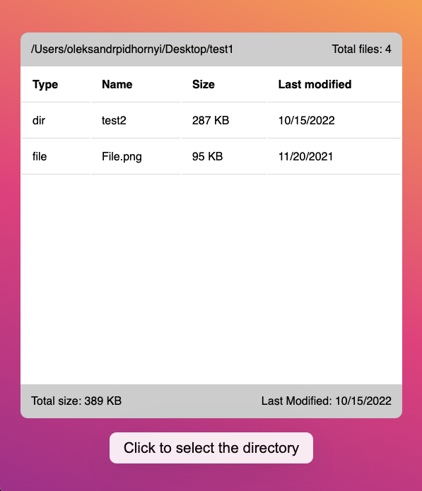

## About
This is a simple electron app that scans any selected folder, and shows info on the contents of this folder.

[Link to the original boilerplate](https://github.com/electron-react-boilerplate/electron-react-boilerplate)

## Screenshot


## Install and run

Clone the repo and install dependencies:

```bash
npm install
```

To run the app in dev mode type
```bash
npm start
```

To tun the tests
```bash
npm run build:main
npm run build:renderer
npm test
```

To build for prod
```bash
npm run package
```
Binaries will be in release/build directory

## How does it work?
The app is build using `electron` framework. For communication between threads it uses proper and secure (hopefully) `IPC` channels, and it uses `Web Workers` to scan the file system asynchronously to avoid freezing up of the UI. <br><br>
The back-end supports two types of directory scan - `shallow` and `deep`. <br>`Shallow` only returns the contents of the directory, and is meant to quickly populate the front-end. <br>
`Deep` recursively scans all subdirectories and calculates the total size of the files. It's expected to take longer.
<br><br>
The front-end requests both scans at the same time, to minimize the delay for the user. As a result, the file list is populated almost instantly, while some other parameters have to wait for the deep scan to finish.
<br><br>
## What's missing?
This project is not entirely production ready, unfortunately. I was having hard time getting it compiled for production, and since I'm not super experienced with Electron, it would be a deep dive for me to understand why the production build is failing.

Also I'm not happy with the tests that I made. I'm not exactly sure how to mock `IPC` requests for integration testing, and also couldn't test the Web Worker code because importing it seemed tricky. My `node.js` testing skills are rusty.
<br>
<br>

The tests that should be added: <br>
1) Integration test of the front-end - make sure it's calling the right sequence of `IPC` requests and correctly displaying the received data. Specifically:
  <ul>
    <li>Front-end makes <i>get-directory</i> request after button click</li>
    <li>After receiving the directory path, both deep and shallow scans are reuqested</li>
    <li>Shallow scan results are populated correctly</li>
    <li>Deep scan results are populated correctly</li>
    <li>If shallow scan completes but deep fails, UI should handle it with grace (Displaying error message is done in the main thread and can't be tested here)</li>
  </ul>
<br>

2) Unit tests of the worker - mock the `fs` library, and make sure the deep scan reaches into every mocked directory and correctly calculates the total size

3) Integration tests of the worker - spin up the worker thread and make sure it communicates correct sequence of `IPC` requests, where every request receives a response to a matching channel.


## Contact

Please shoot a letter to my [email](mailto:pidhornyialex@gmail.com) if you have any questions
